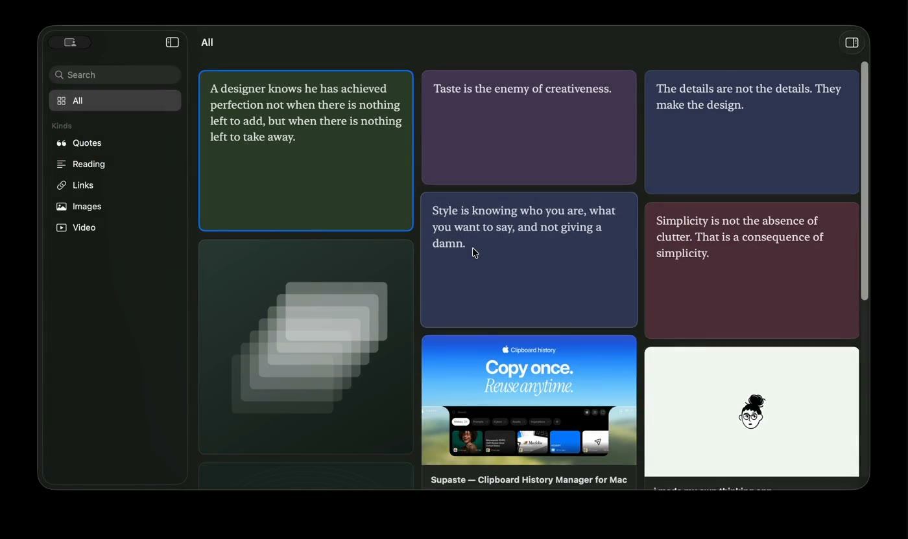
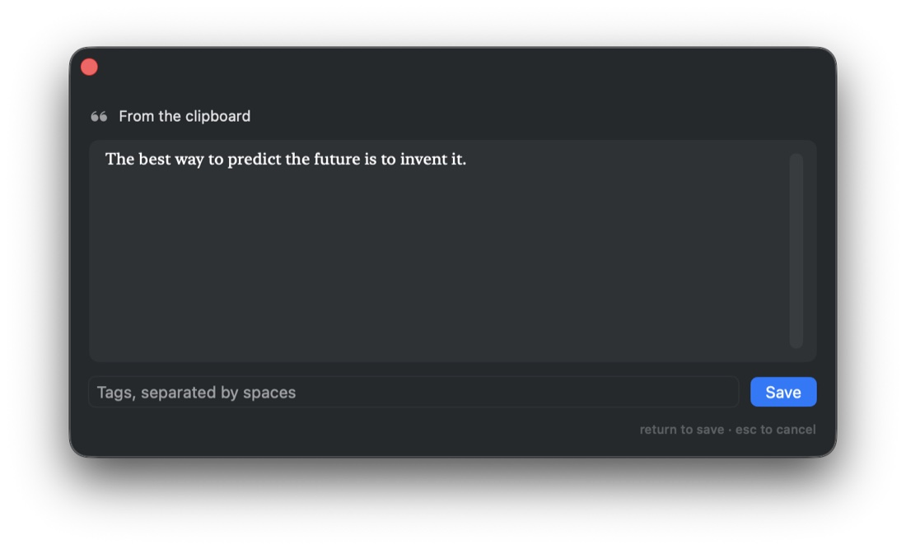

<div align="center">
<a href="https://github.com/kahlfirdausy/Inscra/releases"></a>

<h2>Inscra</h2>
<p>A local-first macOS archive for things worth keeping: quotes, long reads, links, images and video.<br/>One keystroke saves it, one grid brings it back. Nothing is uploaded anywhere.</p>

<a href="https://github.com/kahlfirdausy/Inscra/releases/latest/download/Inscra-v0.1.dmg"><b>Download Inscra v0.1</b></a>

<sub>
<b>Requires macOS 26 Tahoe or later.</b> Apple Silicon and Intel.<br/>
Inscra is not notarised, so macOS blocks the first launch. See
<a href="#opening-it-the-first-time">Opening it the first time</a> below.<br/>
<a href="https://inscra.khalifafirdausy.com">inscra.khalifafirdausy.com</a> ·
<a href="https://github.com/kahlfirdausy/Inscra/releases">All releases</a>
</sub>
</div>

<br/>

<div align="center">


</div>

<hr/>

## About Inscra

Inscra is somewhere to put the things you keep meaning to save. A passage worth
rereading, a link you will want in a year, a picture, a recording. They land in
one grid, newest first, broken up by when you saved them.

It is built for one person on one Mac. There is no account, no server and no
sync you did not ask for, so there is nothing to sign in to and nobody to trust
with what you keep.

<div align="center">

</div>

## What it does

- **Four ways in, one result.** `⌥⌘V` opens a capture panel from anywhere on the
  system. `⌘⇧V` pastes straight into the grid. Images and video can be dragged
  in from Finder. Anything dropped into a watched folder is taken in too,
  including from your phone. All four run the same rules, so what you end up
  with never depends on which door you came through.
- **It works out what you saved.** A link becomes a link, short text a quote,
  long text a reading, a file an image or a video. The guess is editable in the
  inspector, and the quote/reading split is a 400 character rule that will
  sometimes be wrong.
- **Links fill themselves in.** Title, description, site name, cover image and
  favicon arrive in the background. The card appears immediately, so pasting
  never waits on the network. Sites that block scrapers leave a card carrying
  the site's own icon.
- **Nothing gets saved twice.** The same image or URL selects what you already
  had instead of making a copy.
- **Flat tags and search.** No folders, and no hierarchy to invent before you
  are allowed to save anything. `⌘F` searches titles, notes, site names and tags
  at once.
- **From your phone, with one Shortcut.** Point Inscra at a folder both machines
  can see, and a single Save File action is enough to share into it.

<div align="center">

</div>

## Keyboard

| | |
|---|---|
| `⌥⌘V` | Quick capture, from any app |
| `⌘⇧V` | Paste into the grid |
| `⌘⌥I` | Inspector |
| `Space` | Preview the selected card |
| `Return` | Open its source |
| `⌘⌫` | Delete |

## Free

All of it. Every feature, no item limits, no trial clock, no account. Inscra
costs nothing to run, so it costs nothing to use.

If it becomes part of how you work, you can put in whatever it is worth to
you at [buymeacoffee.com/khalifafirdausy](https://buymeacoffee.com/khalifafirdausy).
There is a link at the foot of the sidebar and another in Settings. Nothing in
the app changes either way, and nothing is held back if you do not.

## Where your archive lives

```
~/Library/Application Support/Inscra/
├── Inscra.store      the database
└── Assets/           images, video, covers, favicons
```

One folder. Copy it and you have backed up the whole thing.

Inscra deliberately does not run in the App Sandbox. Sandboxed, that path
silently redirects into an opaque per-app container, and files outside a few
blessed locations fail to capture with no error at all. The trade is that
Inscra is not on the Mac App Store, and was never headed there.

## Opening it the first time

Inscra is not notarised by Apple, so macOS stops the first launch of it the way
it stops anything it has not seen before.

1. Double click Inscra. macOS shows **"Inscra" Not Opened** and says Apple
   could not verify it is free of malware. It says this about every
   application it has not seen before.
2. Click **Done**. The highlighted blue button says *Move to Trash*, and it
   is not the one you want.
3. Open **System Settings**, then **Privacy & Security**, scroll to the
   bottom and click **Open Anyway**. You will not be asked again.

## Not built, on purpose

Full text article archiving, Markdown export, iCloud sync, a Safari share
extension, iOS, and clipboard history. Each one was considered and deferred.

## Reporting something

Bugs and requests go in [Issues](https://github.com/kahlfirdausy/Inscra/issues).
This repository holds the releases and the issue tracker; the source is kept
separately.

---

<div align="center">
<sub>Made by <a href="https://khalifafirdausy.com">Khal</a>.</sub>
</div>
